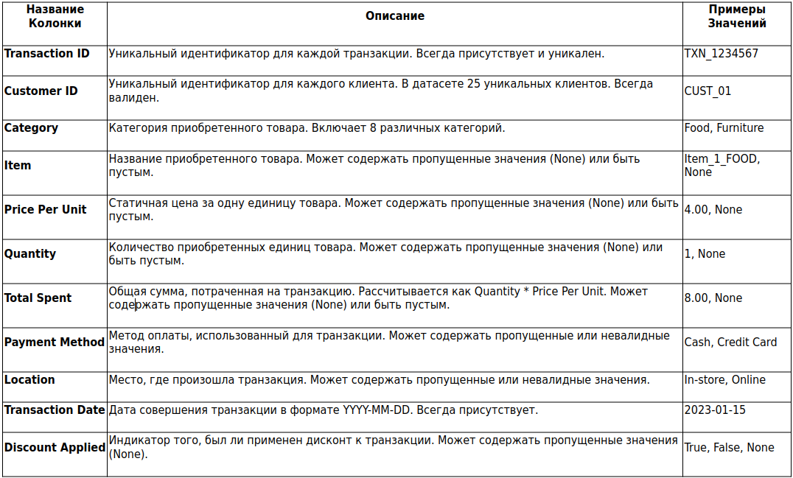

# Retail Store Sales Data Analysis Project

## Исходные данные

Вам предоставлен датасет `retail_store_sales.csv`, который содержит информацию о транзакциях в розничном магазине. Он включает информацию о продажах из восьми товарных категорий, в каждой из которых по 25 товаров со статичными ценами. Датасет содержит пропущенные значения, несогласованные данные и ошибки.

Всего в таблице 11 столбцов:

## Задачи

### 1. Загрузка и предварительная обработка данных

#### 1.1. Загрузка и вывод схемы
Загрузите файл `retail_store_sales.csv`. Выведите первые 5 строк загруженного DataFrame и его схему (`df.printSchema()`).

#### 1.2. Очистка названий столбцов
Преобразуйте названия всех столбцов к единому регистру - snake_case. Выведите обновленную схему DataFrame или названия столбцов, чтобы убедиться в изменении названий.

#### 1.3. Преобразование типов данных
Проанализируйте к каким типам данных относятся данные в столбцах и приведите столбец к соответствующему типу.

### 2. Очистка и валидация данных

Для наглядной оценки результата и отслеживания прогресса в процессе очистки данных рекомендуется после каждого основного этапа восстановления выводить количество пропусков в изменённых колонках. Это поможет оценить эффективность каждого шага. Также можете показывать пример из 20 строк, где видно, как данные были восстановлены. Для этого можно использовать методы `.show()` или `.limit()`.

#### 2.1. Заполнение отсутствующих Price Per Unit

Если отсутствует цена за единицу товара, но общая сумма и количество имеются, вычислите цену за единицу и заполните пропущенные значения. Округлите до двух знаков после запятой.

#### 2.2. Восстановление отсутствующих Item

Так как данные статические для каждого товара, то составьте справочник товаров в отдельный DataFrame с Category, Item и Price Per Unit.

Для транзакций, где отсутствует название товара, но имеется категория и цена, попытайтесь определить название товара, путём объединения (join) с загруженным справочником товаров.

#### 2.3. Заполнение отсутствующих Quantity и Total Spent

Проверьте есть ли транзакции, с пропусками в Total Spent, но с данными в Quantity и Price Per Unit, если такие данные есть, то восстановите их.

Аналогично проверьте Quantity, если значения отсутствует, но имеются сумма транзакции и цена за товар, вычислите количество проданного товара и заполните пропущенные значения. Результат приведите к целому числу.

#### 2.4. Удалите оставшийся строки с пропусками в Category, Quantity, Total Spent и Price Per Unit

### 3. Разведочный анализ данных

#### 3.1. Самые популярные категории товаров
Рассчитайте общее количество проданных единиц товара для каждой категории. Определите Топ-5 категорий по общему количеству проданных единиц.

#### 3.2. Анализ среднего чека

- Рассчитайте среднее значение Total Spent для каждого метода оплаты. Округлите до двух знаков после запятой.
- Рассчитайте среднее значение Total Spent для каждой места где прошла оплата. Округлите до двух знаков после запятой.

### 4. Генерация признаков

#### 4.1. Временные признаки
Добавьте два новых столбца на основе Transaction Date:

- `day_of_week`: День недели
- `transaction_month`: Месяц транзакции

#### 4.2. Продажи по дням недели
Рассчитайте среднюю сумму продаж (Total Spent) для каждого дня недели. Выведите результаты, отсортированные по дням недели.

#### 4.3. Продажи по месяцам
Рассчитайте среднюю сумму продаж (Total Spent) для каждого месяца. Выведите результаты, отсортированные по месяцам.

#### 4.4. Признаки клиента
Рассчитайте customer_lifetime_value (CLV) для каждого клиента как общую сумму (Total Spent), потраченную этим клиентом за все транзакции. Выведите Топ-10 клиентов по их CLV (customer_id и их CLV).
